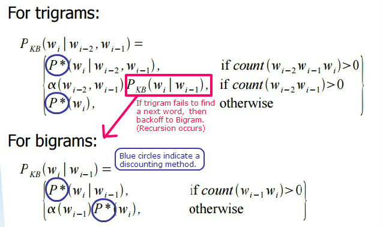
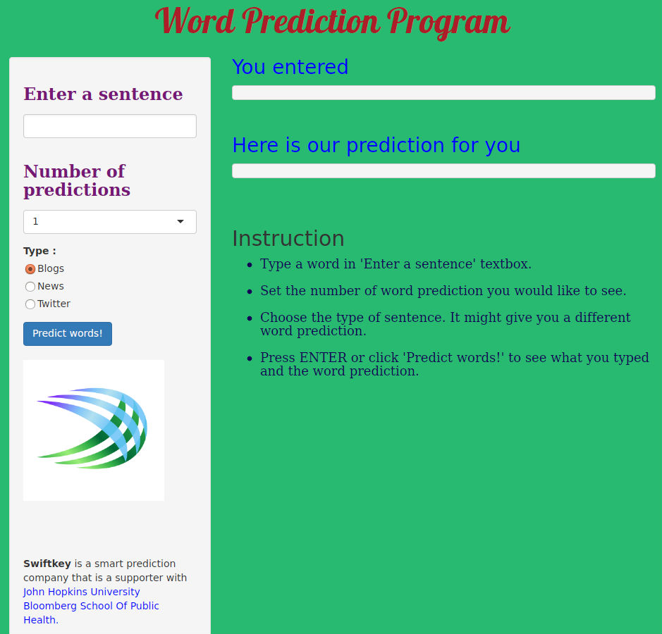

Data Science Capstone Project Final Report
========================================================
author: Sungmin Kim
date: Aug 13 2015
transition: rotate
font-family: 'Helvetica'
css: custom.css

This is the final pitch of my algorithm and app. This project was supported by Swiftkey and John Hopkins University.

Overview and Basic Concepts
======================================================= 

- Our data set is gathered from diverse sources such as Blogs, News, and Twitters. The main goal of this project is to build a word prediction app. 

- In the middle of development, I decided to separate data sets(blogs, news, twitters) for better prediction based on contexts. 

- Generating n-gram models with n greater than 3 is not that efficient. According to the **Markov Chain Model**, the probability of next word is affected only based on the previous n-1 words.

- Applied **Good-Turing** Estimation that distributes probabilities of existing events to unseen events and **Discounting method** to avoid zero probabilities.  

- Used **Katz-backoff** model. When the prediction failed to search a word in n gram, then back-off model will search through the (n-1) gram.

Description of Prediction Algorithm
========================================================

1. I removed all profane words and sorted them as descending order. Then I used 80% of each data as a training set to build n-gram models. 

2. Users type a word and if this is a beginning of a sentence, Bigram will search the best prediction. 

3. If an input is not a first word, Trigram will search the best prediction. 

4. If <b>Trigram</b> fails to search the next word, backoff to <b>Bigram</b> with applying discounting method. If Bigram fails to search the next word, simply show the most frequent single word in the <b>Unigram</b>.

 

Explanation of How the app works
=======================================================

 
- There is an instruction of how the program works. 

Future Works and References
========================================================

- Might do some sentimental analysis (This app can't predict human emotions well)
- Search even better algorithm to maximize the efficiency
- Handle proper nouns (i.e. celebrity's name)
  

## References
- My word prediction app : [https://kimx3129.shinyapps.io/final](https://kimx3129.shinyapps.io/final)
- Katz Backoff Algorithm : [http://www.cs.rutgers.edu/cs/media/Class/Grad/cs533-spring2010/Lecture03_2X.pdf](http://www.cs.rutgers.edu/cs/media/Class/Grad/cs533-spring2010/Lecture03_2X.pdf)
- Good-Turing Estimation : [https://en.wikipedia.org/wiki/Good%E2%80%93Turing_frequency_estimation](https://en.wikipedia.org/wiki/Good%E2%80%93Turing_frequency_estimation)
- Coursera Data Science Specialization : [https://www.coursera.org/specialization/jhudatascience/1](https://www.coursera.org/specialization/jhudatascience/1) 
